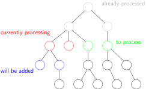

# Overview

This library contains code to perform a lattice enumeration (i.e. searching lattice vectors within some radius for a shortest, nonzero vector) on the GPU, using Cuda. The interface is designed to be usable as external enumerator in [fplll](https://github.com/fplll/fplll).

# Building

On Linux, you can use the provided Makefile.

On Windows, you can use the provided Visual Studio solution. However, note that you will not be able to use the generated binaries with fplll, as fplll only supports Linux binaries.

## Details on the Makefile

The Makefile provides the following goals:

 - `make rls` builds an executable that, when run, executes the unit tests
 - `make lib` builds a library `libcudaenum.so` that can be linked to fplll or another application
 - `make cpudbg` builds an executable that can be executed on a system without GPU (however, cuda must be installed) and runs the tests that are possible in such a setting
 - `make dbg` builds the test executable without optimization and with debug symbols
 - `make perf` builds an executable that, when run, executes the unit test and a longer running test
 - `make dbglib` builds the library without optimization and with debug symbols

The compilers `nvcc` and `g++` will be found if available on PATH, and `nvcc` is additionally looked up at `/usr/local/cuda/bin/nvcc`. These settings can be overridden by the variables `NVCC` and `CXX` respectively. Note that compiling with other host compilers than `g++` is untested.

## Linking with fplll

After the library was build using `make lib`, it is possible to build fplll such that it uses its function for all enumerations. For that, configure the fplll build with `./configure --with-extenum-dir=<absolute_path_to_lib_directory> --with-extenum-lib=cudaenum --with-extenum-func=fplll_cuda_enum` (if you have not build fplll before, a `./autogen.sh` might be necessary). Then build fplll using `make`.

# Code organization

Most of the code of this project is contained in header files, as the implementation makes (extremely) heavy use of templates. In particular on the device, this this is the only efficient way to write abstractions. 
The following files contain significant parts of the implementation
 - `enum.cuh` contains the actual algorithm, and the main entrypoint is the function `enumerate()`
 - `recenum.cuh` contains a recursive enumeration (very similar to fplll) that is used as a subroutine
 - `cuda_wrapper.h` resp. `cuda_wrapper.cu` contain the implementation of the interface to fplll
 - `streaming.cuh` contains the communication between host and device during the running enumeration (notably, found solution points are passed to the host)

The other files are either test files or wrap primitives in a way that allows the CPU-only mode, i.e. testing most of the code on a system that has no GPU.

# CUDA Enumeration Idea

In this part, we describe how the enumeration algorithm is parallelized on Cuda Blocks and Threads. 
For detailed information, see [the report](https://eprint.iacr.org/2021/430).

## CUDA Blocks vs Warps vs Threads 

In Cuda, functionality is distributed between the "host" (CPU) and the "device" (GPU). Usually, the host prepares the input,
and then starts many threads executing the same function on the device. These threads are grouped into a hierarchy
 - 32 threads are grouped into a warp. All threads in a warp are executed synchronously, so they always execute the same instruction. Branching within a warp is bad for performance.
 - Up to 32 warps form a block. Within a block, synchronization is possible via barriers.
 - All blocks form the grid that is executed on the device. Classically, grid synchronization is only possible by calling and joining multiple functions on the host.
In addition to avoiding branches on warp level, memory accesses should also be aligned on warp level (i.e. all threads in a warp should address subsequent words in memory).

## Enumeration tree

In principle, given a triangular basis of a rank n lattice L (usually the gram-schmidt coefficients), enumeration is a tree search:

The nodes on level i in the tree are given by all points with norm less than some given limit, in the projection of L into the subspace Un-i, defined as the space perpendicular to the first n-i basis vectors. Therefore, the root of the tree is only the origin. The children of a node at level i are now given by all points in the projection of L into Un-i-1 whose projection into Un-i is the parent point.

## The search

If each Cuda thread performed a simple depth-first search independent of each other, this would lead very inefficient branching and memory accesses. Instead, a hybrid between depth-first search of the tree and breadth-first search is chosen:

Each thread warp works independently. However, within a warp, we use a breadth-first idea, so there is always a list of nodes whose subtrees have yet to be searched ("list of open nodes"). In each step, each thread gets one of these buffer nodes assigned, and calculates its children (usually in muliple batches to prevent huge children counts), which are again added to the list. In contrast to the standard breadth-first search however, open nodes at the downmost tree level are processed first, so that we find first solutions as fast as possible, and to prevent huge list sizes. For efficiency reasons, all threads always work on nodes on the same level, and the open nodes are stored by level. 

Summarized, this open node list is not used to make sure that we search nodes nearer to the root first, but to be able to assign each thread a node from the same level (leading to efficient memory access patterns), as we can choose from many open nodes.

## Compacted Enumeration tree

To reduce the great overhead introduced by managing and storing enumeration tree nodes in memory, the program instead works with a compacted version of the tree. A constant count of tree levels are only one level in the compacted tree. Therefore, a correspondingly high subtree with a single root in the old tree is now a node in the compacted tree, with accordingly many children.

Formally, for a constant count of tree levels c, the tree nodes at level i are now points in the projection of L into Un-ci with bounded norm. The root is still only the origin, but the children nodes are now lifted not only one dimension, but c dimensions. In particular, an enumeration algorithm is again required to compute the children. For this, an adaption of the recursive base enumeration is used.

Apart from these changes, the search works exactly as in the simple enumeration tree, except now the internal state of the recursive algorithm must be stored with the nodes, so that we can resume the children enumeration later.